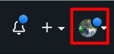
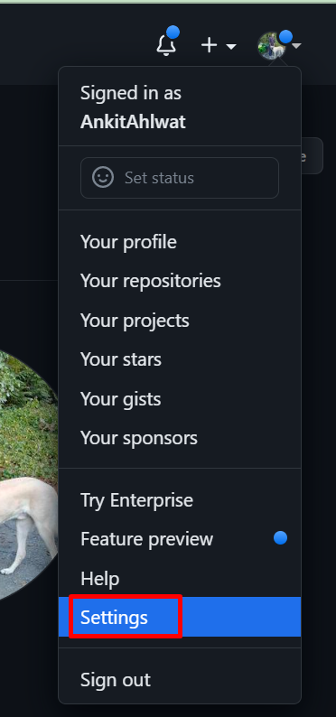
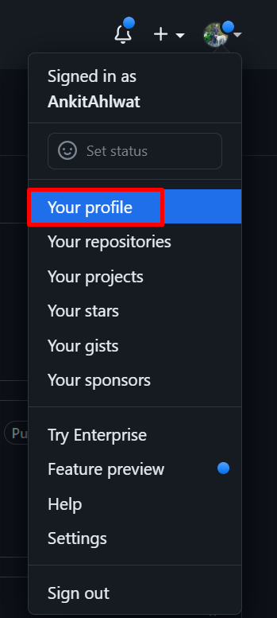

# Customizing your Github

It is common to link your Github on your resume and for employers to look at it. Because of this it is important to have a well organized Github profile. In this competitive job market you need to stand out! This section will cover some important features and settings to improve your profile and customize your Github experience.

## Set your profile picture

This is one of simplest, but most effective ways to have a professional looking Github. Do not use a profile picture of your favourite Anime character or worse, a default profile picture. Upload a head shot of yourself and make sure it is high resolution.

1. Log in to your GitHub account.
2. Click on your profile icon in the top right corner of the page. 

3. Click on "Settings" in the dropdown menu. 

4. Click on "Public Profile" in the left-hand sidebar.
5. Click on "Edit" on the right side of the page. 

6. Click "Upload a Photo"
7. Upload a new photo or choose one from your existing repositories.
8. Crop your photo if necessary and click "Set new profile picture" to save.

!!! note
    Steps 1-2 will be re-used to access your profile settings. Anytime steps 1-2 are referred to you can come back here to view them again.

## Edit your profile bio and details

Another easy improvement to make is adding a description to your bio. This a good way for others to get to know a bit about you and your interests.

1. Follow steps 1-2 from above.
2. Click on "Your Profile". 

3. Click on the "Edit profile". 

4. Add or edit your name, bio, company, location, and other details as desired.
5. Click "Save profile" to save your changes. 

!!! tip "Tip"
Keep your bio description short! This isn't meant to be an autobiography, it should be a brief description.

## Choose a custom theme for your profile

Themes are a great way to stand out among others.

1. Follow steps 1-2 above to access your profile settings.
2. Click on the "Theme chooser" button.
3. Browse through the available themes and click on one to preview it.
4. Once you find a theme you like, click "Select theme" to apply it to your profile.

!!! tip "Tip"
Avoid using themes that are distracting or difficult to read.

## Pin repositories to your profile

This step is critical. Employers want to see your projects and they won't be spending a lot of time on your profile. All repositories that you wish to share need to be pinned and immediately accessible at the top of your profile.

1. Go to the repository you want to pin to your profile.
2. Click on the "Settings" tab.
3. Scroll down to the "Features" section.
4. Toggle the "Pinned repository" switch to "On".
5. Choose a number from 1-6 to indicate where you want the repository to appear on your profile.
6. Click "Save" to save your changes.

!!! warning "Warning"
It is important to note that all pinned repositories will be public! That means anyone who visits your profile can view them.

## Customize your dashboard with widgets

Widgets are small applications that you can add to your github dashboard. They range from displaying your code contributions from the past year to your most recently used repositories. Widgets can help keep your profile organized, monitor progress and track your stats!

1. Go to your GitHub dashboard.
2. Click on the "Customize your pins" button in the top right corner of the page.
3. Browse through the available widgets and click on one to add it to your dashboard.
4. Click and drag the widgets to rearrange them on your dashboard.
5. Click "Save" to save your changes.

!!! note
   Your Github dashboard is private, others cannot view it or any widgets you add.
