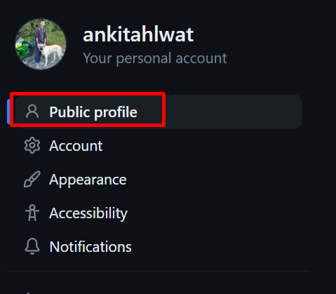
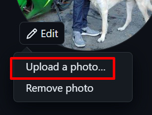
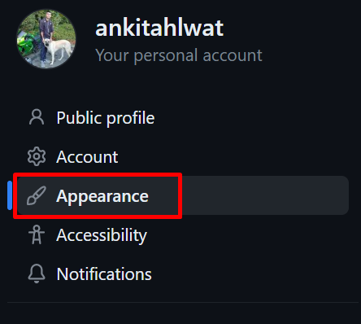
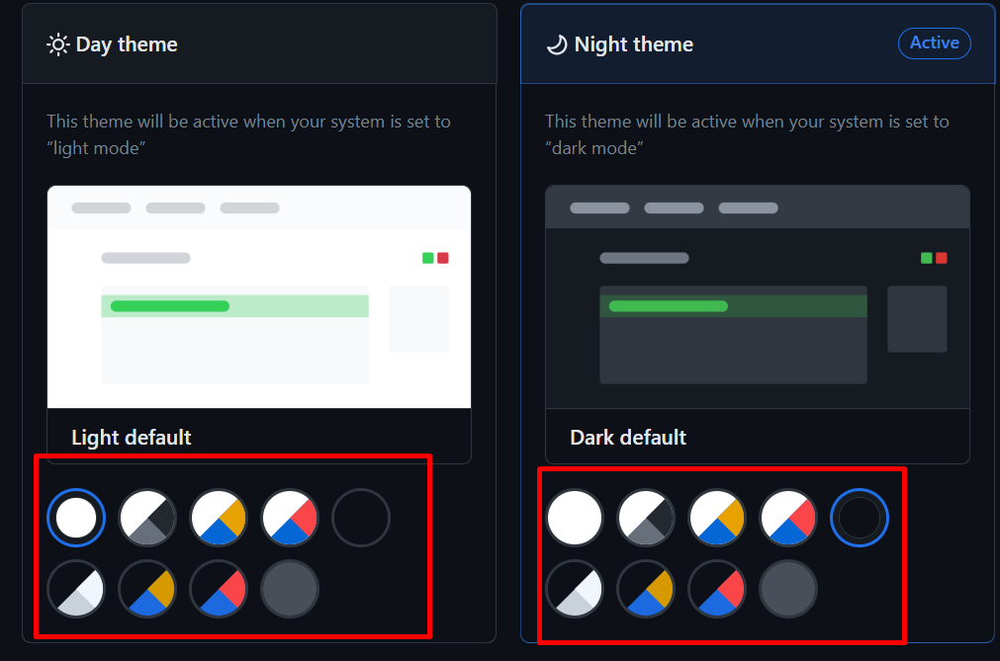
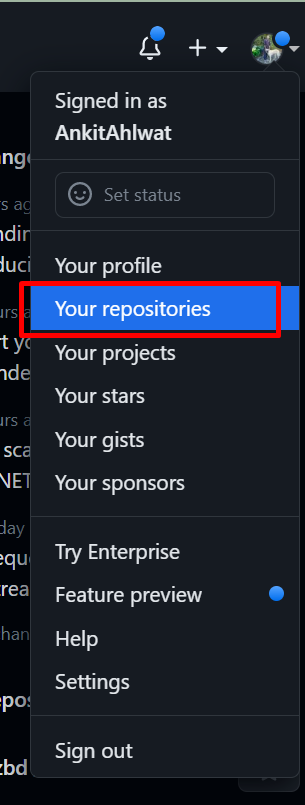
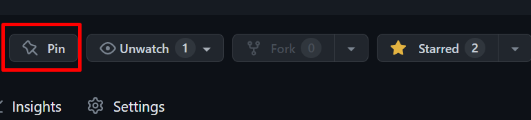

# Customizing your Github

It is common to link your Github on your resume and for employers to look at it. Because of this it is important to have a well organized Github profile. This section will cover some important features and settings to enhance your profile and customize your Github experience.

## Set your profile picture

This is one of your simplest, but most effective ways to have a professional looking Github. Do not use a profile picture of your favourite Anime character or worse, a default profile picture. Upload a head shot of yourself and make sure it is high resolution.

1. Log in to your GitHub account.

2. Click on your profile icon in the top right corner of the page:

    

3. Click on "Settings" in the dropdown menu:

    

4. Click on "Public Profile" in the left-hand sidebar:

    

5. Click on "Edit" on the right side of the page:

    

6. Click "Upload a Photo":

    

7. Upload a new photo or choose one from your existing repositories.

8. Crop your photo if necessary and click "Set new profile picture" to save.

!!! note
    Steps 1-2 will be re-used to access your profile settings. Anytime steps 1-3 are referred to you can come back here to view them again.

## Edit your profile bio and details

Adding a description to your bio is a good way for others to get to know a bit about you and your interests.

1. Follow steps 1-2 from above.

2. Click on "Your Profile" button:

    

3. Click on the "Edit profile" button:

    

4. Add or edit your name, bio, company, location, and other details as desired.

5. Click "Save profile" to save your changes:

    

!!! tip "Tip"

    Keep your bio description short! This isn't meant to be an autobiography, it should be a brief description.

## Choose a custom theme for your profile

Themes are a great way to stand out among others.

1. Follow steps 1-2 from above to access your profile settings.

2. Click on the "Appearance" button:

    

3. Browse through the available themes and click on one to preview it:

    

4. Click on any color theme and it will automatically apply.

## Pin repositories to your profile

Employers want to see your projects and they won't be spending a lot of time on your profile. All repositories that you wish to share need to be pinned and immediately accessible at the top of your profile.

1. Follow steps 1-2 from above to access your repository.

2. Click on "Your repositories" button:

    

3. Go to the repository you want to pin to your profile:

    

4. Click on the "Pin" tab on the top right:

    

!!! warning "Warning"
    It is important to note that all pinned repositories must be made public! That means anyone who visits your profile can view them.

## Conclusion and recap
By the end of this section, you will have successfully learned the following:

- How to change your Github profile picture
- How to pin projects at the top of your profile and edit your bio
- How to personalize your Github profile with themes 
