# Working with Git 

## Overview
Git is a opened source version control system used alongside GitHub. This section will help you work with Git and manage your code on GitHub. You will learn the most commonly used Git commands and when to use them. Apart from the first step, this section is not intended to be followed in chronological order, rather, it should be referred to for individual commands only.

!!! warning "Warning"

    All commands in this section are run in the terminal window. Make sure you are in your project folder when running any commands. Refer to the homepage for more information on the terminal.

## Install and configure Git

If you believe you have already installed git enter the following command to check:

```git
git version
```

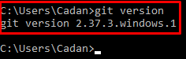

Otherwise, follow the instructions below:

1. Download and install Git from the [**official website**](https://git-scm.com/downloads).
2. Configure Git with your username and email using the terminal:

    ```git
    git config --global user.name "Your Name"
    git config --global user.email "your.email@example.com"
    ```

3. Check that you successfully configured your account, run:

    ```git
        git config --global user.name 
        git config --global user.email 
        ```
    
    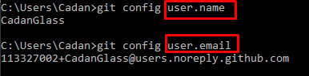

!!! tip "Tip"

    Make sure to replace "Your Name" and "your.email@example.com" with your actual name and email address. This ensures that your github looks professional and it is easy for others to find your work.

## Clone a repository locally

When we clone a repository we make a identical copy, including all folders, from the data stored on Github at the time of cloning. There are several ways to do this, the easiest is by copying the URL. 

1. Navigate to the GitHub repository you want to clone.
2. Click on the **Code** button and copy the URL:

    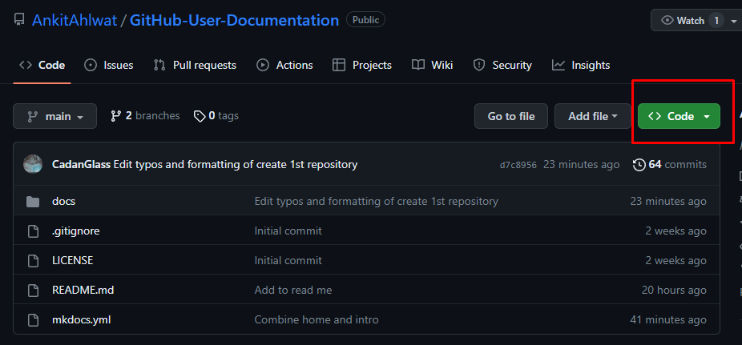

3. Open the terminal and navigate to the location you wish to clone your repository.

4. Run the following command:

    ```git
    git clone <repository_url>
    ```

    By default the clone command will save the repository in a local folder under C:\Users\"your name".

    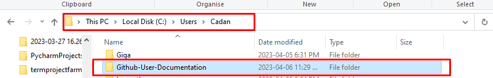

    
5. Run the following command to specify a folder name 

    ```git
    git clone <repo> <folder name>
    ```

    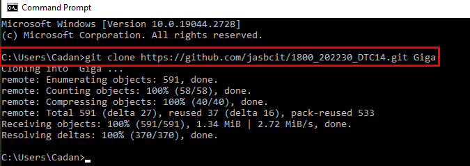

##  Stage and commit changes

Once we make a change to the code in our cloned repository. In order for these changes to be reflected on github we have to "push them". 

 Before pushing your changes you must first stage them. This is useful as you can specify which files you wish to commit. The "." syntax includes all changes.

1. Stage the changes:

    ```git
    git add .
    ```
    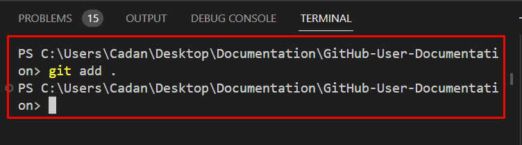

    Nothing will happen after this command however your changes have been staged. If you want to check which commits are currently staged run:
    
    ```git
    git diff --cached
    ```
    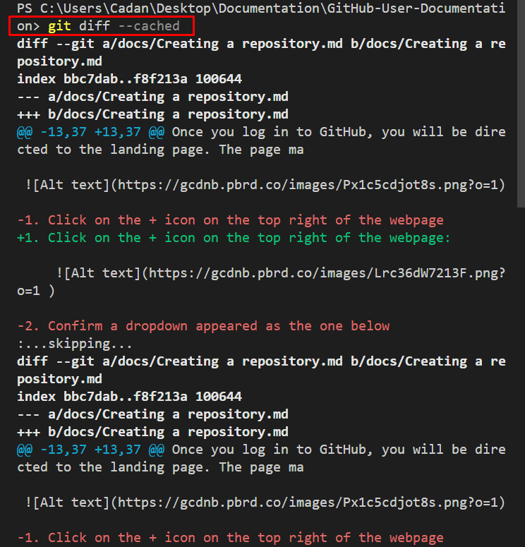

- Commit the changes:

    ```git
    git commit -m "Your descriptive commit message"
    ```
    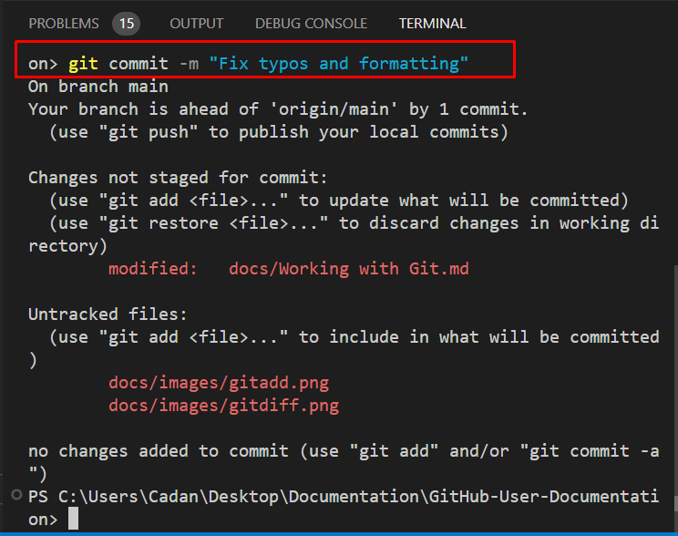

!!! tip "Tip"

    Write clear, concise, and descriptive commit messages that summarize the changes made in the commit.
    Make sure your commit message begins with a imperative verb. This is considered best practice as it allows for others to quickly understand the purpose of your commit.

## Push changes remotely

Now that we have staged the changes we need to push them.

1. Push your changes to the remote repository, run:

    ```git
    git push
    ```

    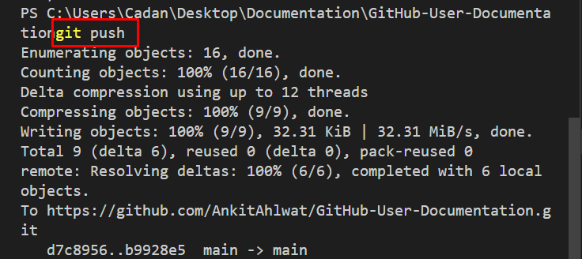

    Now all changes to your repository made locally will be reflected on Github. 

    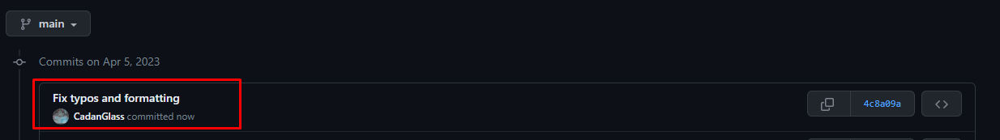

##  Pull remote changes

When collaborators on your project push changes to Github you will have to pull their changes to make sure you have the most up to date code. 

1. Update your local branch with the latest remote changes, run:

    ```git
    git pull
    ```

    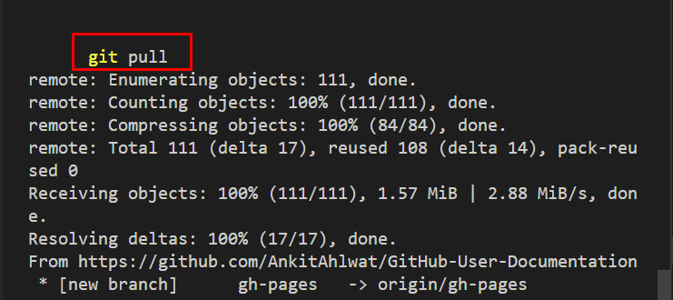

    Unless you had someone else make a change to your cloned repository nothing will change because there is nothing to pull. Most IDE's will create a popup that says "all files are up to date" if this is the case or the terminal will notify you.

    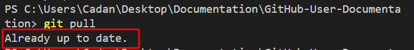

## Merge conflicts

Merge conflicts occur when multiple people alter the same lines of code in a repository and then attempt to merge these changes together. Merge conflicts can be intimidating however they will be broken down into sections:

- Incoming changes 
- Result of the incoming changes
- The current code 

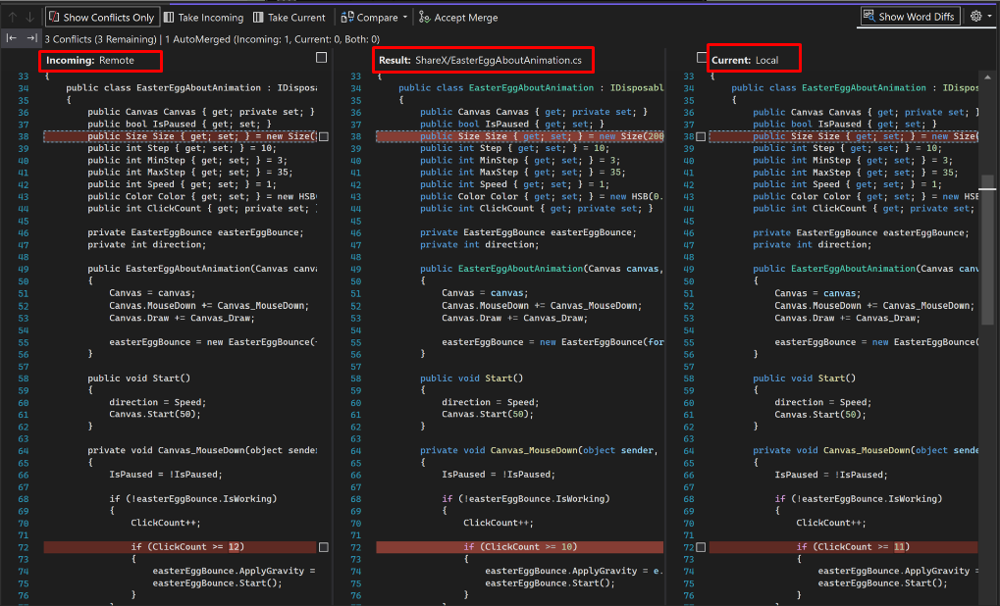

1. Choose which changes you wish to accept and which you want to reject
2. Edit any file(s) to resolve the conflict
3. Stage and commit the changes
4. Push them back to your repository

!!! tip "Tip"

    Make sure to always pull any changes before beginning to work on a codebase. This will reduce the likelihood of merge conflicts occurring.

## Navigate commit history

It is often necessary to view commit history in order to know what code has been changed.

1. View the commit history, run:

    ```git
    git log
    ```
    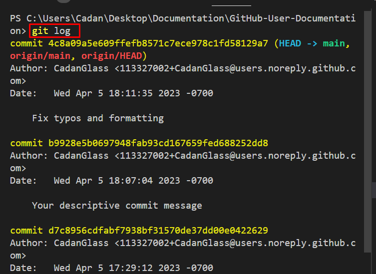

## Undo or modify commits

If you make a mistake in your commit it is possible to undo it. The simplest way to do this is by using the command git revert. This will create a new commit which is the opposite of an existing commit. To specify which commit you wish to undo you need the id of the commit. The id can be viewed by using the git log command from the previous section.

1. Undo or modify commits, run:

    ```git
    git reset <commit_id>
    ```

    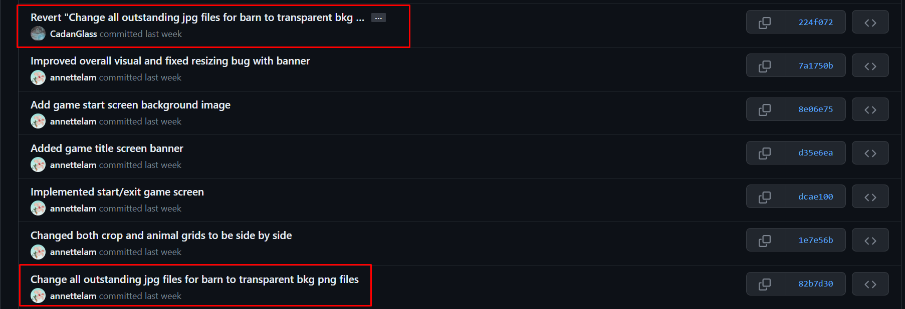

    In the example above the original commit at the bottom was reverted at the top. 

&nbsp;

# Conclusion and recap

By the end of this section, you will have successfully learned the following:

- How to install and configure Git
- How to clone a repository 
- How to stage, commit, and push changes to GitHub
- How to navigate commit history and resolve conflicts

**Great job!** You are now familiar with essential Git commands and best practices for managing your code on GitHub.
